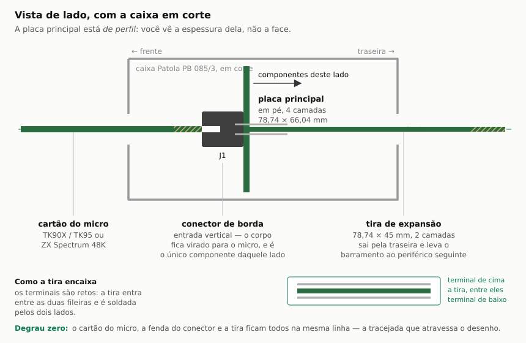
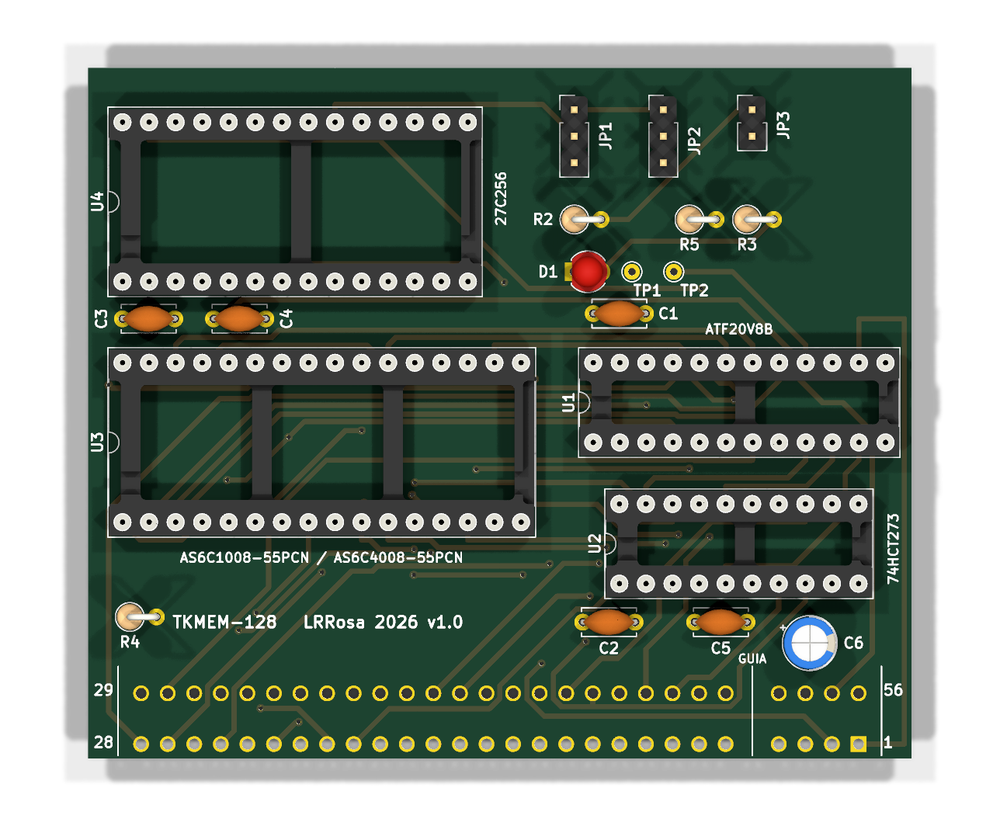
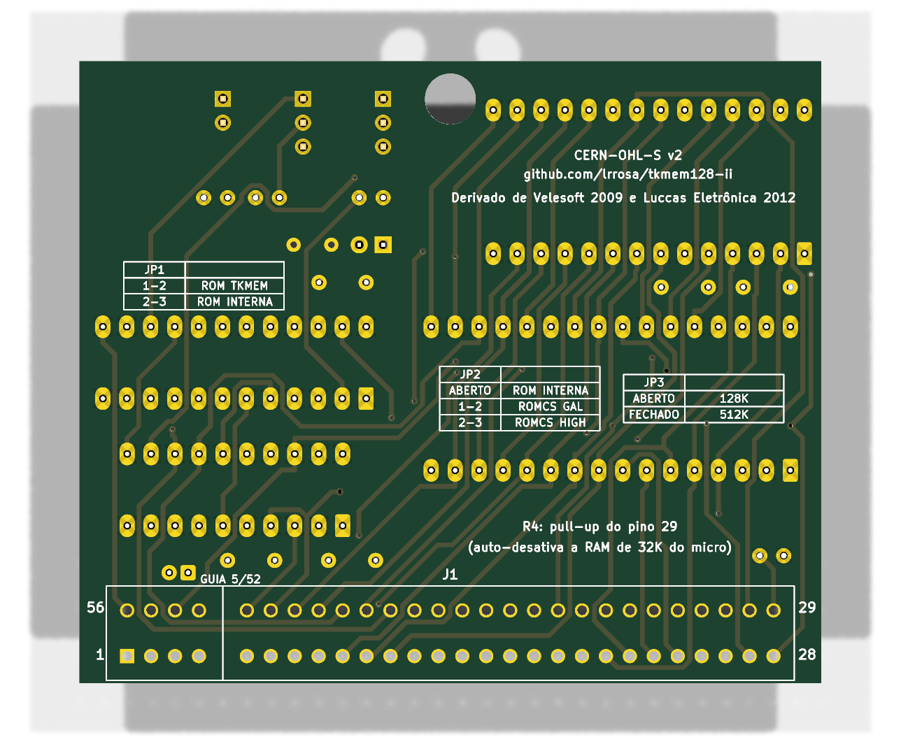
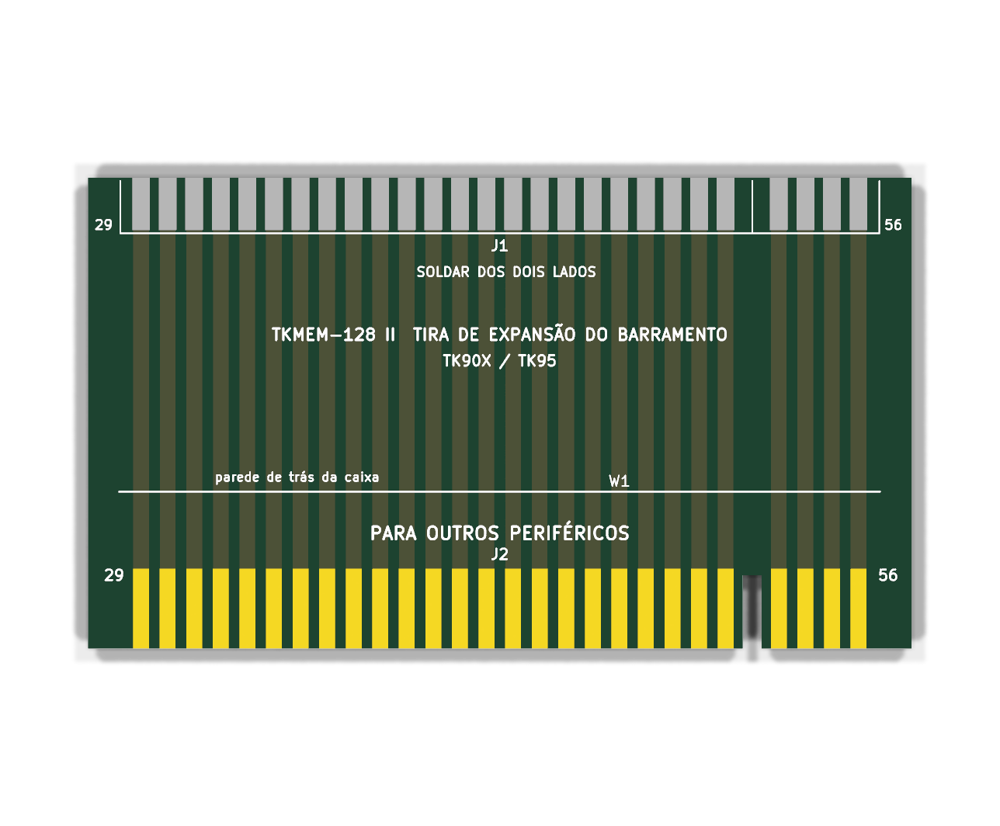
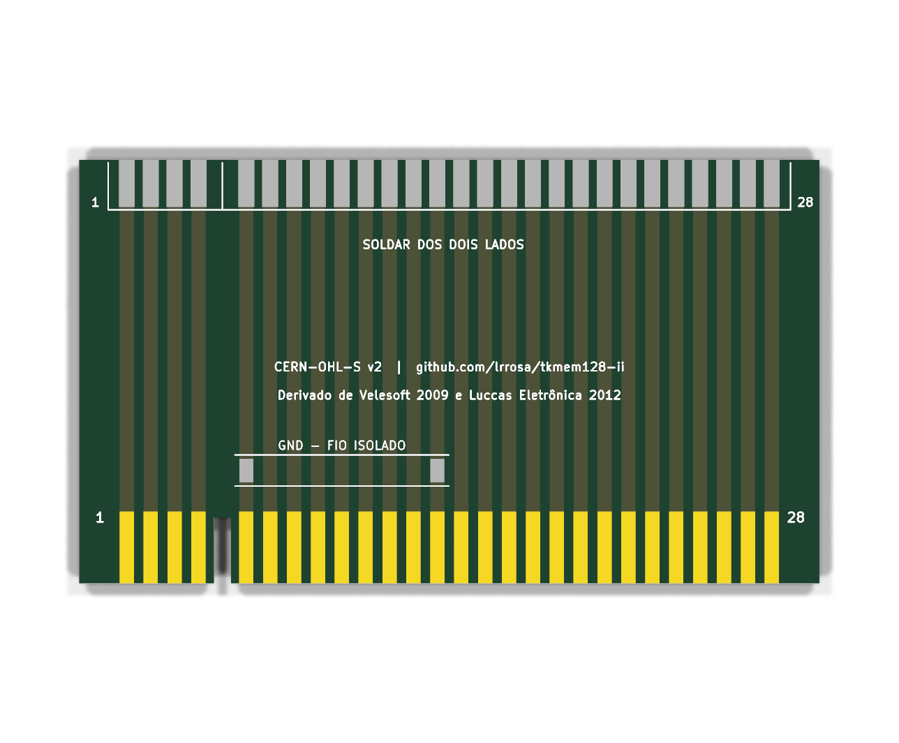

# TKMEM-128 II

Expansão externa de **128 KB (ou 512 KB) de RAM paginada no padrão ZX Spectrum 128**
para **TK90X, TK95 e ZX Spectrum 48K**. Redesenho completo em **KiCad 10**, com
arquivos de fabricação prontos.

> O nome vem da placa brasileira que originou este redesenho, mas o circuito é do
> **Velesoft e nasceu para o ZX Spectrum 48K**. A adaptação de 2012 ao TK usava um
> contato que no Spectrum carrega vídeo; aqui isso foi corrigido, e a placa voltou
> a servir nas duas famílias. Ver [Compatibilidade](#compatibilidade).

> **Estado: projeto validado em software, ainda não montado em hardware.**
> ERC e DRC estão zerados e a netlist foi conferida contra a intenção de projeto,
> mas nenhuma placa foi fabricada nem testada num micro real. Antes de mandar fabricar,
> leia [`docs/ANTES-DE-FABRICAR.md`](docs/ANTES-DE-FABRICAR.md) — há itens que
> dependem de medir peças físicas.
>
> O conector de borda é o **TE/AMP 5645235**, de entrada vertical. As cotas do
> footprint saíram do desenho de cliente e estão no
> [datasheet arquivado](docs/), mas ninguém montou a peça ainda.

---

## Este projeto é uma derivação

Ele não inventa o circuito: junta e redesenha dois trabalhos anteriores.

| Origem | Autor | O que veio de lá |
| --- | --- | --- |
| **external 128kb upgrade** (`zx48_to_128-EASY_3`), 2009 | **Velesoft** (Pavel Cimbal, República Tcheca) | O circuito base: as equações do GAL20V8, o latch da porta `0x7FFD` e o esquema de paginação da SRAM, incluindo a extensão de 512K |
| **TKMEM-128**, 2012 | **Luccas Eletrônica** (Eduardo Luccas, Brasil) | A adaptação ao TK90X/TK95: soquete de EPROM com a ROM do Spectrum 128, jumpers de seleção de ROM, a auto-desativação da RAM interna de 32K por um pino livre do barramento, e a divisão em placa principal + expansor |

Créditos também a **Flávio Matsumoto**, que sugeriu o circuito do Velesoft para
os TKs e identificou a caixa Patola PB 085/3, e a **Daniel Jose Viana
(danjovic)**, cujo trabalho documentou as cotas da placa para essa caixa.

Este redesenho é distribuído sob **CERN-OHL-S v2** (ver [LICENSE.txt](LICENSE.txt)),
uma licença *fortemente recíproca*: quem fabricar, modificar ou distribuir
precisa disponibilizar as fontes das modificações sob a mesma licença.

---

## O que a placa faz

O ZX Spectrum 128 difere do 48K em três coisas: 128K de RAM em 8 bancos de 16K,
o chip de som AY-3-8912, e o espelhamento da memória de vídeo ("shadow video").
Esta placa entrega **a primeira**. O som AY exige interface separada; o shadow
video é inviável numa interface externa, porque exigiria interceptar a RAM baixa
da ULA dentro do micro.

Na prática a grande maioria dos jogos de 128K funciona — a exceção são os poucos
títulos que dependem do shadow video.

### Mapa de memória

| Faixa | Quem responde |
| --- | --- |
| `0x0000-0x3FFF` | ROM — a interna do micro, ou a 27C256 da placa (jumper) |
| `0x4000-0x7FFF` | RAM baixa **interna do micro** (memória de vídeo da ULA). Não é decodificada aqui |
| `0x8000-0xBFFF` | SRAM externa, **banco 2 fixo** |
| `0xC000-0xFFFF` | SRAM externa, banco selecionado pela porta `0x7FFD` |

Como a SRAM externa cobre `0x8000-0xFFFF`, **os 32 KB superiores de RAM interna
precisam ser desativados** — é a única alteração necessária dentro do micro, e a
única coisa que difere entre TK e ZX Spectrum. Veja
[`docs/PREPARAR-O-TK.md`](docs/PREPARAR-O-TK.md).

### Porta 0x7FFD

Um `74HCT273` latcheia o barramento de dados quando o GAL detecta a escrita na
porta (`A15=0`, `A5=1`, `A1=0`, `/IORQ` e `/WR` ativos):

| Bit | Sinal | Função |
| --- | --- | --- |
| 0–2 | `BANK0..BANK2` | Banco de RAM em `0xC000` |
| 3 | `VRAM` | Shadow screen — latcheado, **sem uso** nesta arquitetura (disponível em TP1) |
| 4 | `ROMA14` | Seleciona a metade da 27C256 |
| 5 | `DIS128` | Trava a paginação até o reset |
| 6–7 | `BANK3..BANK4` | Extensão 512K (só no modo ZX512) |

A trava do bit 5 é elegante: `DIS128` entra na equação do clock do latch
(`CLK7FFD = ... + DIS128`), então ao ser setado o clock fica preso em nível alto
e o latch nunca mais é acionado.

---

## Compatibilidade

**TK90X, TK95 e ZX Spectrum 48K.** Não é uma promessa vaga: reduz-se a uma regra
que dá para verificar.

O barramento de expansão é o mesmo conector de 2×28 nas duas famílias, mas
**nove contatos não carregam a mesma coisa** em cada uma. Enquanto a placa não
tocar nenhum deles, ela serve nas duas:

| Contato | No TK90X/TK95 | No ZX Spectrum 48K |
| --- | --- | --- |
| 4 | +9 V | USS |
| 7 | N.C. | GND |
| 15 | GND | sinal |
| 16, 17, 18 | livres | **Y, V e U do vídeo componente** |
| 34, 35 | 12 V | difere |
| 37 | **+5 V** | **−5 V** |

Esta placa liga **34 dos 54 contatos, e nenhum é dessa lista.** Alimentação sai
dos contatos 3 (+5 V), 6 e 14 (GND), que são iguais nas duas máquinas.

A verificação é automática, para a afirmação não envelhecer:

```bash
python tools/confere_compatibilidade.py
```

Ele cruza a lista de divergências de `busdef.py` com os contatos que a netlist
realmente usa, e falha se algum aparecer.

> ⚠️ **O que ainda é específico de cada máquina: desativar a RAM interna de 32 KB.**
> Isso não é opcional — sem desativar, a memória do micro colide com a SRAM
> externa em `0x8000-0xFFFF`. O método documentado aqui é o do TK (fio do contato
> 29 ao pino 10 do IC27). **Num ZX Spectrum o ponto interno é outro e não foi
> verificado por nós**; a auto-desativação pelo contato 29 é inerte lá, porque
> naquele micro o contato é N.C.
>
> Também não montamos a placa num Spectrum: a compatibilidade acima é do
> barramento, conferida contato a contato, não bancada.

---

## As duas placas

A placa de componentes fica **em pé** dentro da caixa. O conector de borda é
soldado **diretamente nela** — e como esse conector é de entrada vertical
(a placa que entra fica perpendicular à que segura o conector), a fenda dele cai
no plano horizontal e recebe a placa do micro.

Os terminais do conector são **retos** e atravessam a placa, sobrando ~3,18 mm
do outro lado em duas fileiras a 4,85 mm. A **tira de expansão** entra **entre
essas fileiras** — uma passa por cima dela, a outra por baixo — e é soldada
**dos dois lados**. Ela não tem conector nenhum: ilhas de solda nas duas faces
de um extremo, dedos de borda no outro.



O **conector fica fora da caixa Patola**, atravessando o recorte que se abre na
frente dela. Não é escolha estética: no TK e no ZX Spectrum a abertura
`EXPANSION` é **recuada dentro da carcaça**, então a caixa encosta na traseira do
micro e só o conector entra. A placa, por sua vez, assenta rente ao fundo da
caixa.

> No conector, **1..28 fica na fileira de baixo** (junto à aresta inferior da
> placa), igual à fileira inferior da placa do micro; 29..56 fica do lado de
> dentro. É a mesma convenção no TK e no ZX Spectrum, onde essas fileiras são
> chamadas de B e A.
>
> ⚠️ **O lado dos componentes tem que ficar virado para a tira de expansão**,
> nunca para o lado do conector. Ao contrário, a placa dentro da caixa esbarra
> no micro e não encaixa direito. Na prática o conector de borda é **o único
> componente do lado do cobre**: entra por baixo e é soldado por cima.

| Placa | Arquivo | Conteúdo |
| --- | --- | --- |
| Principal | [`hardware/tkmem128-ii.kicad_pro`](hardware/) | GAL20V8B, 74HCT273, SRAM DIP-32, EPROM 27C256, 3 jumpers, desacoplamento e o conector de borda |
| Tira de expansão | [`hardware/expansor/`](hardware/expansor/) | Ilhas de solda nas duas faces de um lado, dedos de borda do outro — nenhum componente, só o fio de terra `W1` |

A **placa principal é de 4 camadas**; a tira de expansão, de 2.

| Camada | Placa principal | Tira |
| --- | --- | --- |
| F.Cu | sinal | 27 retas de 1,5 mm (pinos 29..56) |
| In1.Cu | **plano de GND** inteiro | — |
| In2.Cu | **plano de +5V** inteiro | — |
| B.Cu | sinal | 27 retas de 1,5 mm (pinos 1..28) |

Como todos os componentes são passantes, cada ilha de `+5V` e de `GND` toca o seu
plano direto: **não há uma única trilha de alimentação nas faces de sinal**, e
nenhuma via serve só para alimentação. Sinal de 0,5 mm, isolação de 0,2 mm,
21 vias, e nenhum fio de ligação.



O furo grande no topo é o `H1`, e ele não é furo de parafuso: por ali **passa a
torre** de fixação da caixa Patola, que tem Ø5 externo e nasce do fundo da
tampa. O parafuso da caixa corre dentro da torre e nunca toca a placa — `H1`
serve para localizar, não para apertar.

O conector é passante e é usado pelos dois lados — por baixo entra o conector,
por cima solda a tira —, então a numeração dele está serigrafada nas duas
faces.



O verso é o manual da placa. Traz as **três tabelas de jumper**, a função do
`R4` e a licença — na bancada, com um shunt na pinça, isso vale mais que este
README.



A tira é soldada dos dois lados, então cada face traz a numeração dos **seus**
pinos: 29..56 na frente, 1..28 no verso.



---

## O que mudou em relação ao original

| Melhoria | Motivo |
| --- | --- |
| **Passagem do barramento** (dedos de borda na expansora) | O original ocupava o barramento; agora dá para encadear outros periféricos |
| **Desacoplamento por CI** (100 nF em cada um) + 10 µF de reservatório | O original tinha desacoplamento mínimo |
| **4 camadas com planos de GND e +5V inteiros** | Alimentação sem uma única trilha nas faces de sinal, retorno de corrente curto e imunidade a ruído. O original era de 2 camadas |
| **Trilha de sinal de 0,5 mm** | O dobro da primeira tentativa deste redesenho, e no mesmo patamar da placa original. Menos sujeito a erro de fabricação, curto e defeito difícil de achar |
| **Jumper JP2 com duas estratégias de ROMCS** | O `ROMCS` do barramento é **ativo em nível alto** para desligar a ROM interna, o oposto da saída `/ROMCS` do GAL. É a explicação mais provável para a ROM 128 do original "funcionar num TK e não em outro". JP2 permite escolher entre acionar pelo GAL ou fixar em nível alto (como fazem os cartuchos da Interface 2), com R5 em série |
| **Auto-desativação sem jumper nenhum** | A original usava o **pino 17**, livre no TK mas **V do vídeo componente no ZX Spectrum** — daí o jumper e o aviso de que a posição errada danifica o micro. Aqui o sinal vai pelo **pino 29**, que é N.C. nas duas máquinas, então o pull-up é permanente e **JP4 deixou de existir**. Ver [a análise](docs/PREPARAR-O-TK.md#por-que-o-pino-29) |
| **GAL com `.jed` pronto e verificado** | O usuário não precisa montar nada: o `.jed` distribuído é gerado das equações deste projeto e conferido fusível a fusível contra o mapa de referência (checksum `C5752`, zero divergências) |
| **Degrau zero na corrente de periféricos** | A tira de expansão solda nos terminais do próprio conector, ficando coplanar com a placa do micro. O periférico seguinte entra no mesmo plano, sem escadinha |
| **Bit N da porta 7FFD no flip-flop N** | O original embaralhava as entradas do latch; aqui a ordem é natural e o esquemático se lê sozinho |
| **Endereços e dados da EPROM 1:1** | Obrigatório (o conteúdo da ROM é fixo) e documentado |
| **Pontos de teste** (`VRAM`, `CLK7FFD`) | Para depurar sem grampear em perna de CI |
| **LED de energia** (opcional) | Diagnóstico imediato |
| **Peças em produção na BOM** | AS6C1008 e ATF20V8B no lugar de peças só encontráveis como estoque antigo |

---

## Configuração dos jumpers

| Jumper | Posição | Efeito |
| --- | --- | --- |
| **JP1** SELECIONA ROM | 1-2 | ROM 128: a EPROM da placa responde em `0x0000-0x3FFF` |
| | 2-3 | ROM interna: EPROM desligada (padrão) |
| **JP2** ROMCS BARRAMENTO | aberto | Usa a ROM interna do micro (padrão) |
| | 1-2 | Aciona `ROMCS` pelo GAL (comportamento da placa original) |
| | 2-3 | Fixa `ROMCS` em nível alto (estilo Interface 2) |
| **JP3** ZX128/ZX512 | aberto | 128K — SRAM `AS6C1008` (padrão) |
| | fechado | 512K — SRAM `AS6C4008` |

Esta tabela está **serigrafada no verso da placa**, uma por jumper, com as
mesmas palavras — ver o render do verso acima.

> ⚠️ **JP1 em 1-2 sem JP2** não faz nada útil: sem desligar a ROM interna, os dois
> chips disputam o barramento de dados. Use os dois juntos ou nenhum.

> **A auto-desativação da RAM não tem jumper.** `R4` mantém o **pino 29** em
> nível 1 permanentemente, e esse pino é N.C. tanto no TK quanto no ZX Spectrum.
> Num Spectrum a placa não faz nada ali; num TK, com o fio interno do pino 29 ao
> pino 10 do IC27, ela desliga os 32 KB. Nada a configurar.

### Por que não há solder jumpers de terra

Versões anteriores deste redesenho traziam `SJ1` e `SJ2`, terra extra opcional
pelos pinos **7** (GND só no ZX Spectrum) e **15** (GND só no TK). Foram
**removidos**: o terra já chega pelos pinos **6 e 14**, que são GND nas duas
máquinas, e agora vai direto para um plano interno inteiro. O ganho era marginal
e cada um puxava uma rede do conector até o outro extremo da placa.

Se você quiser mesmo o retorno extra, solde um fio do pino do conector ao plano
de terra — mas confira antes qual é a sua máquina: fechar o pino errado põe um
sinal em curto com o terra.

| Pino | TK90X/TK95 | ZX Spectrum |
| --- | --- | --- |
| 7 | N.C. | GND |
| 15 | GND | sinal |

---

## Lista de material

### Placa principal

| Ref | Valor | Encapsulamento | Observação |
| --- | --- | --- | --- |
| U1 | GAL20V8B ou **ATF20V8B-15PC** | DIP-24 300 mil | Grave [`hardware/gal/tkmem128.jed`](hardware/gal/tkmem128.jed) |
| U2 | 74HCT273 | DIP-20 300 mil | Latch da porta 7FFD |
| U3 | **AS6C1008-55PCN** (128K×8) | DIP-32 600 mil | Ou `AS6C4008-55PCN` (512K×8) no modo ZX512 |
| U4 | 27C256 | DIP-28 600 mil | **Opcional** — ver seção da ROM |
| R2, R4 | 1 kΩ | axial, vertical | |
| R5 | 0 Ω | axial, vertical | Fio; 100–470 Ω se houver disputa no ROMCS |
| R3 | 2,2 kΩ | axial, vertical | Opcional (LED) |
| C1–C5 | 100 nF cerâmico | disco 5 mm, passo 5 mm | |
| C6 | 10 µF eletrolítico | radial 5 mm, passo 2 mm | |
| D1 | LED 3 mm | | Opcional |
| JP1, JP2 | header 1×3 | passo 2,54 mm | |
| JP3 | header 1×2 | passo 2,54 mm | |
| J1 | **TE/AMP 5645235** — conector de borda 56 vias, entrada vertical | passo 2,54 mm, fileiras a 4,85 mm | Único componente do lado do cobre; recebe os dedos do micro |
| — | soquetes torneados DIP-20/24/28/32 | | Recomendado |

### Tira de expansão

Não leva componente nenhum, nem conector: os "conectores" são cobre da própria
PCB, e o único item a soldar além das ilhas é um pedaço de fio.

| Ref | O que é | Observação |
| --- | --- | --- |
| J1 | Ilhas de solda nas duas faces, até a borda | Solda nos terminais retos do conector da placa principal, por cima e por baixo |
| J2 | Dedos de borda | Passagem do barramento ao próximo periférico |
| W1 | Fio isolado curto | Liga as duas ilhas `GND - FIO ISOLADO` no verso (pinos 6 e 14); passa por cima das trilhas, por isso isolado |

---

## Montagem

Guias detalhados:

- [`docs/PREPARAR-O-TK.md`](docs/PREPARAR-O-TK.md) — desativar a RAM interna de 32K
- [`docs/MONTAGEM.md`](docs/MONTAGEM.md) — ordem de montagem, guia do conector, caixa
- [`docs/ANTES-DE-FABRICAR.md`](docs/ANTES-DE-FABRICAR.md) — conferências obrigatórias

Dois pontos que costumam pegar quem monta:

1. **A guia do conector de borda.** O conector de 56 vias vem sem guia. Na
   posição **5/52** você encaixa um pedacinho de PCB (ou material equivalente)
   casando com o rasgo entre os dedos do TK — a placa não tem furos ali,
   porque não há terminal nessa posição. Sem a guia é fácil plugar deslocado
   e danificar o micro.
2. **A tira de expansão é soldada dos dois lados.** Ela entra entre as duas
   fileiras de terminais retos do conector — uma fileira por cima, outra por
   baixo — e as ilhas chegam até a borda, então o terminal encontra cobre
   mesmo se for curto.

---

## Fabricação

Arquivos prontos em [`production/`](production/): Gerber X2, furação Excellon,
BOM e mapa de posições, para as duas placas.

Cada placa tem o seu `gerbers.zip`, que é o arquivo que se envia à fábrica.

| | Placa principal | Tira de expansão |
| --- | --- | --- |
| Camadas | **4** (F.Cu / GND / +5V / B.Cu) | **2** |
| Espessura | 1,6 mm | 1,6 mm |
| Trilha | 0,5 mm | 1,5 mm |
| Isolação | 0,2 mm | 0,25 mm |
| Furo mínimo | 0,3 mm | — (sem furos) |
| Via | 0,8 mm com furo de 0,4 mm | nenhuma |
| Furo não metalizado | 1 × Ø5,4 (`H1`, passagem da torre da caixa) | nenhum |

Tudo folgado dentro da capacidade padrão de fábrica barata — nada aqui entra em
faixa de preço especial, a não ser as 4 camadas da placa principal.

> ⚠️ **Peça 4 camadas para a placa principal.** Se pedir 2 por engano, a fábrica
> descarta os dois planos internos e a placa sai sem alimentação nenhuma — falha
> que não aparece na inspeção visual. Ver
> [ANTES-DE-FABRICAR, item 3b](docs/ANTES-DE-FABRICAR.md).

**A tira de expansão precisa de acabamento em ouro (ENIG) na placa inteira e
chanfro de 45° na borda dos dedos.** Os dedos entram e saem do conector do
periférico seguinte muitos ciclos, e as ilhas de solda do outro extremo também
chegam à borda — HASL descasca nos dois casos. Peça o chanfro explicitamente,
é um item à parte no pedido.

---

## Gravando o GAL

**Já vai pronto**: grave [`hardware/gal/tkmem128.jed`](hardware/gal/tkmem128.jed)
direto no programador. Checksum de fusíveis **`C5752`** — confira no software do
gravador ao abrir o arquivo.

Esse `.jed` não foi copiado de lugar nenhum: é gerado por
[`tools/galgen.py`](tools/galgen.py) a partir das equações deste projeto, e
conferido **fusível a fusível** contra o mapa de referência do projeto do
Velesoft — *zero divergências em 2706 fusíveis*. O fonte em sintaxe GALasm está
em [`tkmem128.pld`](hardware/gal/tkmem128.pld) para quem quiser modificar.

Programadores XGecu (T48/T56) gravam tanto GAL20V8B quanto ATF20V8B.

---

## A ROM do Spectrum 128

**A imagem da ROM não está neste repositório** — ela é copyright da Amstrad/Sky.
O hardware (soquete U4 + jumpers) está lá; a imagem você monta com as suas
cópias de `128-0.rom` e `128-1.rom`:

```bash
cat 128-0.rom 128-1.rom > rom_tkmem128_27c256.bin
```

A ordem importa: `A14` da EPROM vem de `ROMA14` (bit 4 da porta 7FFD), então a
ROM 0 (editor do 128) tem que ficar na metade baixa.

Vale dizer que **a ROM é dispensável**: o autor da TKMEM-128 original deixou de
fornecê-la depois de constatar que os jogos de 128K não dependem dela, e que ela
causava incompatibilidades entre unidades diferentes de TK90X.

---

## Estrutura do repositório

```
hardware/
  tkmem128-ii.kicad_pro/.kicad_sch/.kicad_pcb   placa principal
  expansor/                                   tira de expansão
  lib/                                        símbolos e footprints próprios
  gal/                                        fonte e documentação do GAL
production/
  placa-principal/                            gerbers, furação, BOM, posições, PDF
  tira-expansao/                            idem
docs/
  PREPARAR-O-TK.md   MONTAGEM.md   ANTES-DE-FABRICAR.md
  relatorios/                                 saídas de ERC e DRC
tools/                                        geradores do projeto KiCad
```

A biblioteca de símbolos e footprints é **local ao projeto** — nada depende da
versão das bibliotecas do seu KiCad.

O projeto KiCad **nasceu gerado por script** a partir de uma descrição única da
netlist ([`tools/`](tools/)) — é o que garante que esquemático e placa não
divergem — e depois foi refinado à mão no KiCad. A fonte corrente são os
arquivos em `hardware/`; os geradores ficam como registro e ferramenta de apoio.

### Estado da verificação

| Placa | ERC | DRC | Ligações |
| --- | --- | --- | --- |
| Principal | 0 | 0 erros (6 avisos cosméticos) | 0 pendentes |
| Tira de expansão | 0 | 0 erros (4 avisos cosméticos) | 0 pendentes |

A netlist exportada pelo KiCad foi comparada nó a nó com a intenção de projeto
nas duas placas: **74 nets na principal e 53 na tira, zero divergência**.

---

## Licença

Hardware sob **CERN-OHL-S v2** — ver [LICENSE.txt](LICENSE.txt).

```
Copyright Leonardo Rosa e contribuidores.
Derivado de: "external 128kb upgrade" (Velesoft, 2009)
             TKMEM-128 (Luccas Eletrônica, 2012)

Este código-fonte é licenciado sob CERN-OHL-S v2 ou posterior.
Você pode redistribuí-lo e modificá-lo nos termos dessa licença.
Distribuído SEM QUALQUER GARANTIA, incluindo as de COMERCIALIZAÇÃO,
ADEQUAÇÃO A UM FIM ESPECÍFICO E NÃO-VIOLAÇÃO.
Consulte a CERN-OHL-S v2 para os termos aplicáveis.
```
